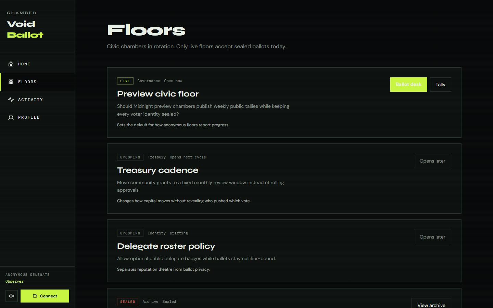

# VoidBallot

Anonymous chamber voting on [Midnight Network](https://midnight.network). Voters cast ballots behind a one-way nullifier. Aggregate Aye / Nay / Void tallies stay public and auditable — wallet identity does not.

**Live dApp (Preview):** [https://voidballot.vercel.app](https://voidballot.vercel.app)

| Level | Codename | Status |
|-------|----------|--------|
| L1 | New Moon | Complete |
| L2 | Waxing Crescent | Complete |
| **L3** | **First Quarter** | **Complete** |

## Screenshots

### Landing (desktop)


### Floors board (desktop)



### Landing (mobile)


## Preview deployment

| Field | Value |
|-------|--------|
| Network | `preview` |
| Frontend | [voidballot.vercel.app](https://voidballot.vercel.app) |
| Contract address | `487486690e45ea44a5f75fc25b7c01f3d155977638a2556c37a667430fb9477a` |
| Indexer | `https://indexer.preview.midnight.network/api/v4/graphql` |
| ZK assets | `/zk/void-ballot` |

Config source: [`web/src/config.ts`](web/src/config.ts). Connect **Lace** or **1AM** on **preview**.

## Test output (4 tests passing)

```text
fahmin@Defiance15:~/midnight/voidballot$ yarn test:local
yarn run v1.22.22
$ MIDNIGHT_NETWORK=undeployed yarn test
$ NODE_OPTIONS='--experimental-vm-modules' vitest run

 RUN  v3.2.4 /home/fahmin/midnight/voidballot

 ✓ src/test/void-ballot.test.ts (4)
   ✓ VoidBallot Contract (4)
     ✓ deploys the chamber with a proposal hash
     ✓ casts an anonymous aye ballot and updates public tally
     ✓ proves the voter cast a ballot without revealing wallet identity
     ✓ rejects a second ballot from the same nullifier

 Test Files  1 passed (1)
      Tests  4 passed (4)
   Start at  03:14:02
   Duration  49.73s

Done in 50.55s.
```

Full dump: [`docs/screenshots/test-passing.txt`](docs/screenshots/test-passing.txt).

## Privacy claim

| Data | Visibility |
|------|------------|
| Voter secret | **Private** (witness + local private state) |
| Wallet ↔ nullifier link | **Private** |
| Nullifier set | **Public** (prevents double voting) |
| Proposal hash | **Public** |
| Aye / Nay / Void counters | **Public** |

An observer can verify tallies and see that a nullifier voted. They cannot recover which wallet owns that nullifier from chain data alone.

> Compact requires disclosed choice when branching into public counters, so per-transaction observers can see which tally moved. Identity attribution remains private.

## Circuits

| Circuit | Purpose |
|---------|---------|
| `castBallot(choice)` | Spend nullifier; increment public tally |
| `proveVoted()` | Prove your nullifier is in the set |

## Quick start

```bash
nvm use 22
yarn install
yarn compile
yarn env:up
yarn test:local
yarn sync:zk
yarn web:dev          # http://127.0.0.1:3010
```

| Script | Purpose |
|--------|---------|
| `yarn test:local` | Integration tests on undeployed |
| `yarn deploy:preview` | Deploy contract to preview |
| `yarn web:build` | Production Vite build (`web/` → Vercel root) |
| `yarn sync:zk` | Copy managed ZK assets into `web/public` |

## Project structure

```
contracts/   Compact + managed ZK artifacts
api/         Shared contract helpers
src/         Wallet, deploy, vitest
web/         React 19 + Vite dApp (Vercel root directory)
```

## Toolchain

| Component | Version |
|-----------|---------|
| Node.js | 22+ |
| Compact | 0.31.1 |
| compact-runtime | 0.16.0 |
| compact-js | 2.5.1 |
| midnight-js | 4.1.1 |
| ledger-v8 | 8.1.0 |

## License

MIT
